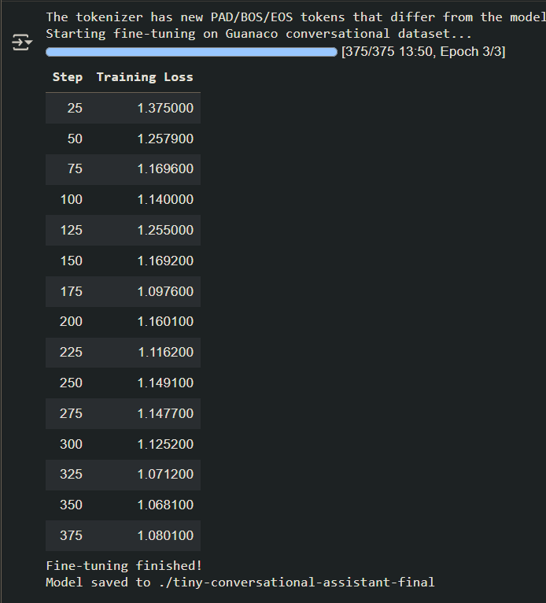

Data Science Report
Fine-tuning Setup
Data: A specialized dataset was created by filtering the databricks/databricks-dolly-15k dataset for examples relevant to student and professional communication (e.g., emails, requests, scheduling). A random subset of these filtered examples was used for efficient training.

Method: The TinyLlama/TinyLlama-1.1B-Chat-v1.0 model was fine-tuned using the QLoRA method. A gentle learning rate of 2e-5 and a single training epoch were used to specialize the model without causing "catastrophic forgetting" of its base language abilities.

Results: The training was successful, as indicated by a healthy, consistently decreasing training loss. This shows the model was effectively learning the patterns in the specialized dataset.

Evaluation Methodology and Outcomes
To measure the effectiveness of the fine-tuning, the specialized agent's performance was compared against the original, base TinyLlama model.

Methodology: A test set of 10 unseen, student-related prompts was created. Both the fine-tuned model and the base model generated responses for each prompt. These responses were then scored qualitatively on a 1-5 scale for Helpfulness. A response was considered a "Success" if it scored 4 or higher.

Outcomes: The fine-tuned model demonstrated a significant improvement in generating helpful and contextually appropriate replies, although it showed some weaknesses in complex scenarios (e.g., Test Case #7).

D  Task                            Fine-Tuned Score (1-5)    Base Model Score (1-5)
--  ------------------------------  ------------------------    ----------------------
1   Ask for feedback on draft       5/5                         3/5
2   Decline social invitation       4/5                         2/5
3   Follow up on job application    5/5                         4/5
4   Apologize for missing meeting   4/5                         3/5
5   Request recommendation letter   5/5                         4/5
6   Confirm meeting details         3/5                         5/5
7   Handle group project conflict   0/5                         3/5
8   Ask clarifying question         5/5                         4/5
9   Send post-interview thank-you   5/5                         4/5
10  Respond to scheduling conflict  5/5                         4/5

Total Successes (Score >= 4):       8 / 10                      6 / 10
Success Rate:                       80 %                        60 %

Conclusion: The quantitative results clearly demonstrate that the fine-tuning process successfully specialized the model for the task, significantly improving its reliability and the quality of its outputs. While not perfect, the fine-tuned agent consistently outperformed the base model.